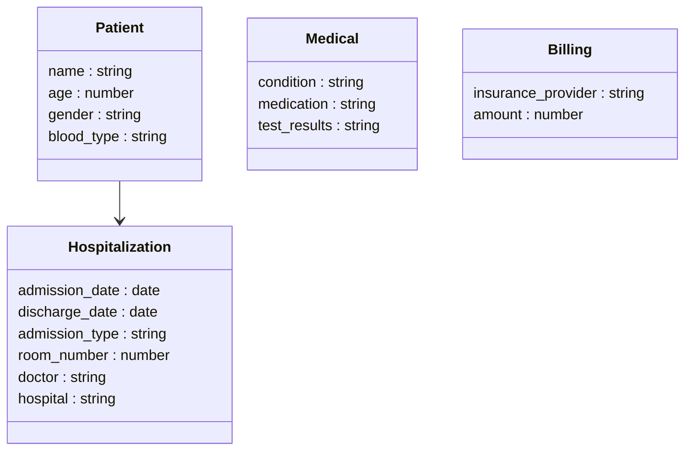

# P5_MongoDB_Docker

## Introduction

Ce projet illustre l’utilisation de **MongoDB** et de **Docker** pour la migration automatisée d’un dataset médical depuis un fichier CSV vers une base de données NoSQL.  
L’objectif est de proposer une solution **scalable, portable et reproductible**, adaptée à des contextes Big Data et potentiellement extensible vers des environnements cloud.

Ce dépôt contient l’ensemble des outils nécessaires pour :
- récupérer un dataset depuis Kaggle,
- importer ce dataset dans MongoDB,
- conteneuriser l’application avec Docker,
- documenter et versionner la solution.

---

## Contenu du dépôt
```
P5_MongoDB_Docker/
├── docker-compose.yaml # Définition des services Docker
├── dockerfile # Construction de l’image du migrateur Python
├── migrate.py # Script Python de migration des données
├── requirements.txt # Dépendances Python
├── README.md # Ce fichier de documentation
└── data/ # Dossier local pour stocker le CSV
└── healthcare_dataset.csv
```
## Description des composants

### 🐳 `docker-compose.yaml`

Fichier clé orchestrant les services Docker :

- `mongo` : conteneur exécutant MongoDB (base de données NoSQL).
- `migrator` : conteneur exécutant le script Python pour importer le CSV dans MongoDB.

Ce fichier configure également les volumes de stockage, les variables d’environnement et les dépendances inter-services (via `depends_on`).

---

### 📦 `dockerfile`

Dockerfile définissant l’image du migrateur Python :
1. Il installe Python et les dépendances (`pandas`, `pymongo`, etc.).
2. Il copie les scripts Python dans l’image.
3. Il définit le point d’entrée pour l’exécution automatique de la migration au démarrage du conteneur.

---

### 🐍 `migrate.py`

Script Python de migration :

- Charge le fichier CSV depuis le dossier `/app/data` (monté depuis le dossier `data/` de la racine).
- Se connecte à MongoDB via l’URI défini dans un environnement Docker.
- Transforme les lignes CSV en documents JSON compatibles MongoDB.
- Insère les documents dans la collection `patients`.
  
Ce script est conçu pour être réutilisable et paramétrable via des variables d’environnement.

---

### 📄 `requirements.txt`

Liste des bibliothèques Python requises par `migrate.py`.  
Les principales sont :
- `pandas` — pour la lecture et la manipulation du CSV.
- `pymongo` — pour l’interaction avec MongoDB.
- `kagglehub` - pour le téléchargement du CSV
---

### 📁 `data/`

Ce dossier doit contenir le dataset CSV que l’on souhaite importer (par exemple `healthcare_dataset.csv`).  
Il est utilisé comme **volume Docker** pour être accessible depuis le conteneur `migrator`.

---

## Comment exécuter le projet

### 1. Création des variables d'environnement

Copiez `.env_sample` vers `.env`, puis renseignez les valeurs (remplacez les `...`) :
  * DB_USER=... (le nom utlisateur/utiliser comme admin)
  * DB_PASSWORD=... (le mot de passe de connection à la base de données pour l'admin)
  * DB_PORT=... (le port, attention doit être un nombre comme par exemple 27017)
  * DB_NAME=... (le nom de la base de données)
  * DB_READ_USER=... (le nom utilisateur pour le rôle lecteur)
  * DB_READ_PASSWORD=... (le mot de passe pour le rôle lecteur)
  * DB_READWRITE_USER=... (le nom utilisateur pour le rôle auteur)
  * DB_READWRITE_PASSWORD=... (le mot de passe pour le rôle auteur)

### 2. Lancer les services avec Docker

Dans un terminal, à la racine du projet :
```bash
docker compose up --build
```
Cette commande va :

  * Télécharger le csv

  * Créer un dossier `data`

  * Déplacer le fichier csv dedans

  * Construire l’image du migrateur Python.

  * Démarrer MongoDB dans un conteneur.

  * Exécuter le script de migration dans le conteneur migrator.

  * Importer toutes les lignes du CSV dans la collection MongoDB.

3. Vérifier l’import

Vous pouvez vérifier que les données ont bien été importées dans un autre terminal :

```bash
docker exec -it mongodb mongosh -u admin -p admin_password
```

Puis, dans le shell Mongo :

```js
use healthcare_db
db.patients.find().limit(5).pretty()
```

## Présentation des rôles
### Admin
Donne les pouvoirs administrateur sur la base de données, celui-ci permet d'obtenir l'entièreté des droits sur la base de données (lecture,écriture,création,création d'utilisateur/rôles).
### Lecteur
Donne à l'utilisateur les droits en lecture de la base de données. Il permet donc de consulter la base sans pouvoir la modifier.
### Ecriture et lecteur
Donne à l'utilisateur les droits en écriture et en lecteur de la base de données. Il permet donc de consulter la base de données et la rédaction/modification de nouvelles données.
### Justification des rôles
Ces rôles sont nécessaire car le client ne souhaite pas que toutes les personnes se connectant à la base de données ai l'ensemble des droits.
Il faut donc établir plusieurs utilisateurs de plusieurs niveau de sécurité : 
- Admin : Utilisateur d'administration et d'initialisation
- Lecture : Lecture, servant à la consultation des données (sans modifications)
- Lecture/Écriture : Ayant les droits de lecture mais également d'écriture pour la modification et la maintenance

## Étapes de migration
### Extraction des données (Extract)
1. Création du dossier data (si nécessaire)
2. Téléchargement du dataset `healthcare-dataset.csv` via Kagglehub si celui-ci n'est pas déjà présent
3. Copie du fichier `healthcare-dataset.csv` dans le dossier `data`
### Transformation des données (Transform)
1. Lecture du csv via Pandas
2. Correspondance des colonnes vers un document noSQL avec les champs (Patients,Medical,Hospitalization,Billing)
3. Normalisation des types
4. Constitution des lots de 1000 documents pour l'insertion
### Chargement des données (Load)
1. Connexion à MongoDB via l'URI MongoDB
2. Création d'un index unique (Patients<->Hospitalization)
3. Insertion des documents dans la collection Hospitalisation (les doublons sont ignorés)


## Stockage et indexation
Les documents sont stockés dans la collection `hospitalisations` de la base `healthcare_db` (par défaut).
L’index unique évite les doublons lors des relances de migration et garantit l’idempotence (la réutilisation du script produit le même résultat).

## Étapes d'authentification
### Création des rôles
Lors du lancement du docker build, le logiciel va créer les utilisateurs présentés dans la section `Présentation des rôles` via le script `mongo-init.js`.
### Hachage du mot de passe
Les mots de passe ne sont jamais stockés dans le code, mongoDB va le hashé via le SCRAM.

## Réseau Docker
Le `docker-compose.yaml` déclare un réseau dédié afin de rendre explicite la communication entre services s'appelant `mongo_network`.